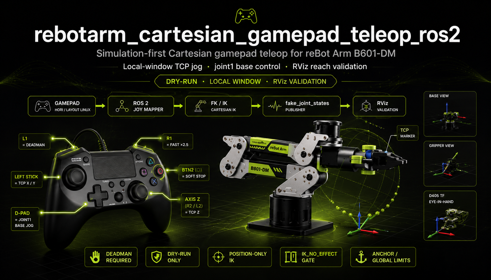

# rebotarm_cartesian_gamepad_teleop_ros2

> Simulation-first Cartesian gamepad teleop for **reBot Arm B601-DM** — local-window
> TCP jog, joint1 base control, and RViz reach validation.

[](https://github.com/danieldoradotalaveron-rb/rebotarm_cartesian_gamepad_teleop_ros2/actions/workflows/ci.yml)
[](https://docs.ros.org/en/jazzy/)
[](https://www.python.org/)
[](https://opensource.org/licenses/Apache-2.0)
[](https://github.com/Seeed-Projects/reBotArmController_ROS2)

<p align="center">
  
</p>

## ⚠️ Development status

> **Work in progress — simulation / RViz only.**  
> Default mode is **`dry_run`**: gamepad → IK → fake joint states → **RViz**.  
> **Does not command the real arm today.**

| Now | Planned |
|-----|---------|
| RViz validation, local-window jog, joint1 base jog | Hardware bring-up, safety bridge, tuning |
| Dry-run only (`output_mode: dry_run`) | Isaac Sim — **after Seeed URDF is sim-ready** |

**Roadmap:** hardware tests and refining.

**Contributions welcome** — issues and PRs on the teleop repo.

Overlay workspace (same pattern as [`rebotarm_monitor_ros2`](../rebotarm_monitor_ros2)).
Build it **after** the driver fork provides `rebotarm_msgs` and `rebotarm_bringup`.

## Quick start

Prerequisites: driver fork built, `reBotArm_control_py` in
`../third_party/reBotArm_control_py`, and `ros-jazzy-joy`.

From the driver fork root:

```bash
just build-driver
just build-teleop
just run-joy              # terminal 1
just run-joy-mapper       # terminal 2
just run-cartesian-core   # terminal 3
just run-teleop-validation-rviz  # terminal 4
```

Standalone (without `just`):

```bash
source /opt/ros/jazzy/setup.bash
source /path/to/reBotArmController_ROS2/install/setup.bash
cd /path/to/rebotarm_cartesian_gamepad_teleop_ros2
colcon build --symlink-install --base-paths src && source install/setup.bash
```

## Requirements

- ROS 2 Jazzy.
- Sourced driver workspace with `rebotarm_msgs`, `rebotarm_bringup`.
- Vendored [`reBotArm_control_py`](https://github.com/Seeed-Projects/reBotArmController_ROS2)
  at `../third_party/reBotArm_control_py` (or set `REBOTARM_DRIVER_WS`).
- `ros-jazzy-joy` for gamepad input.

## Repository layout

```text
rebotarm_cartesian_gamepad_teleop_ros2/
├── README.md
├── docs/hero.png
└── src/rebotarm_cartesian_teleop/   # ament_python package
```

## Testing

**Unit tests** (no driver/SDK) — run in this repo's CI:

```bash
cd src/rebotarm_cartesian_teleop
source /opt/ros/jazzy/setup.bash
export PYTHONPATH="${PWD}:${PWD}/rebotarm_cartesian_teleop${PYTHONPATH:+:${PYTHONPATH}}"
python3 -m pytest test/unit -q
```

**Integration tests** (driver fork, SDK, bringup, FK/IK) live in the driver fork
at `integration/rebotarm_cartesian_teleop/test/`. With driver + overlay built:

```bash
just test-teleop-integration   # from driver fork root
```

Or `just test-teleop` for colcon unit test + integration in one go.

## License

Apache-2.0 (same as driver fork).
